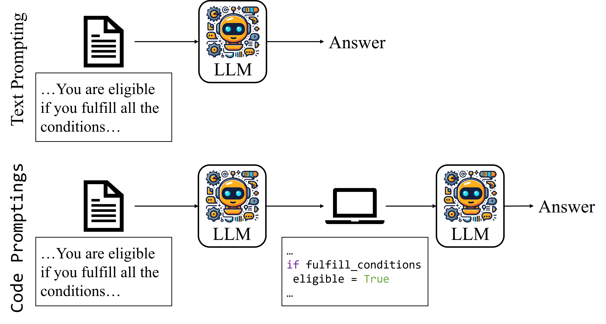

# Code Prompting Elicits Conditional Reasoning Abilities in Text+Code LLMs

This repository includes the code and prompts we used in our 2024 arXiv paper "Code Prompting Elicits Conditional Reasoning Abilities in Text+Code LLMs."

> **Abstract:** We hypothesize that code prompts can trigger conditional reasoning in LLMs trained on text and code. 
We propose a chain of prompts that transforms a natural language problem into code and prompts the LLM with the generated code. We conduct experiments across two datasets: ConditionalQA, a scenario-based question answering (QA) dataset and BoardgameQA, a boardgame-based QA dataset with conflicting rules. Code prompts achieve large gains compared to text prompts. We also observe that code prompts are more efficient, requiring fewer demonstrations, and that they trigger superior state tracking of variables or key entities.



## Project structure
### Scripts
* `boardgameqa_code.ipynb` -- This notebook runs `code prompts` on `BoardgameQA`
* `boardgameqa_text.ipynb` -- This notebook runs `text prompts` on `BoardgameQA`
* `conditionalqa_code_prompt.ipynb` -- This notebook runs `code prompts` on `ConditionalQA`
* `conditionalqa_text_prompt.ipynb` -- This notebook runs `text prompts` on `ConditionalQA`
### Backend
* `src` -- This folder contain the classes that define `text prompts` and `code prompts` for `ConditionalQA` and `BoardgameQA`
* `data` -- This folder contains the the training, dev, and ICL demonstrations used in the experiments (including ablations).
* `outputs` -- This folder contains all the prompts (inputs and outputs). It also includes the evaluation results of each prompt. 

## Requirements
* openai
* langchain
* scikit-learn

You also need an Azure OpenAI or OpenAI API account and put your key in the notebook to run them.

## Installation
```
conda create --name code_prompting python=3.9
conda activate code_prompting
pip install -r requirements.txt
```

## Running the experiments 🏃
To reproduce our main experiments, you just need to run these notebooks:
* `boardgameqa_code.ipynb`
* `boardgameqa_text.ipynb`
* `conditionalqa_code_prompt.ipynb`
* `conditionalqa_text_prompt.ipynb`

❗️ Dont' forget to add your OpenAI API keys!

### Expected results 🔬 
| Prompt Method | CondQA       | BGQA-1       | BGQA-2       | BGQA-3       |
| ------------- | ------------ | ------------ | ------------ | ------------ |
| Text Prompt   | 56.32 ± 1.06 | 62.80 ± 0.28 | 55.00 ± 0.56 | 47.59 ± 0.00 |
| Code Prompt   | 59.17 ± 0.74 | 69.40 ± 1.13 | 62.00 ± 1.70 | 55.30 ± 0.42 |

❗️ Check out the paper 📃 to see all the experiments and analysis!  

Contact person: Haritz Puerto, haritz.puerto@tu-darmstadt.de

https://www.ukp.tu-darmstadt.de/

https://www.tu-darmstadt.de/


Don't hesitate to send us an e-mail or report an issue, if something is broken (and it shouldn't be) or if you have further questions.

> This repository contains experimental software and is published for the sole purpose of giving additional background details on the respective publication. 

Please use the following citation if you find our paper and/or code useful:

